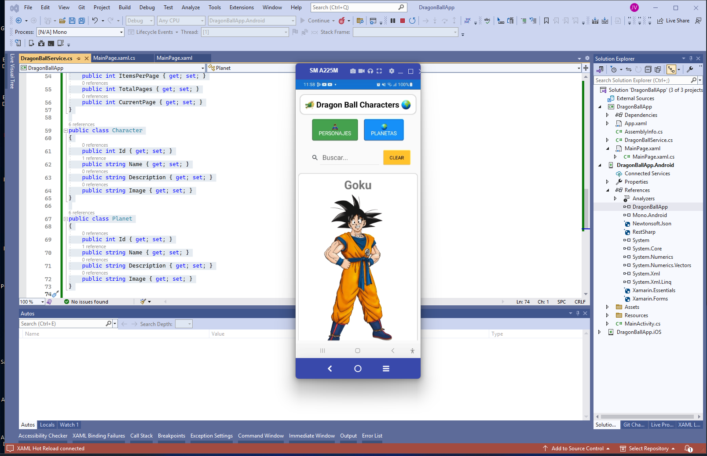
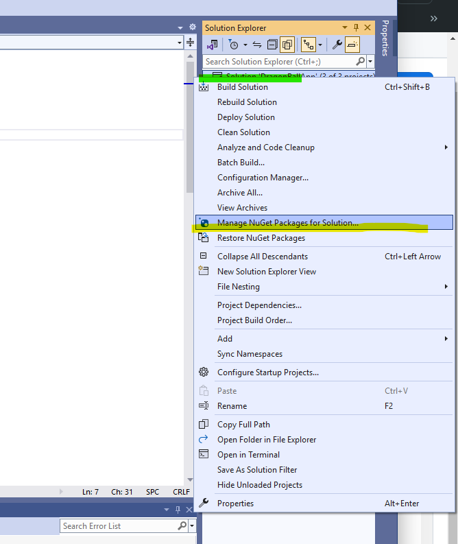
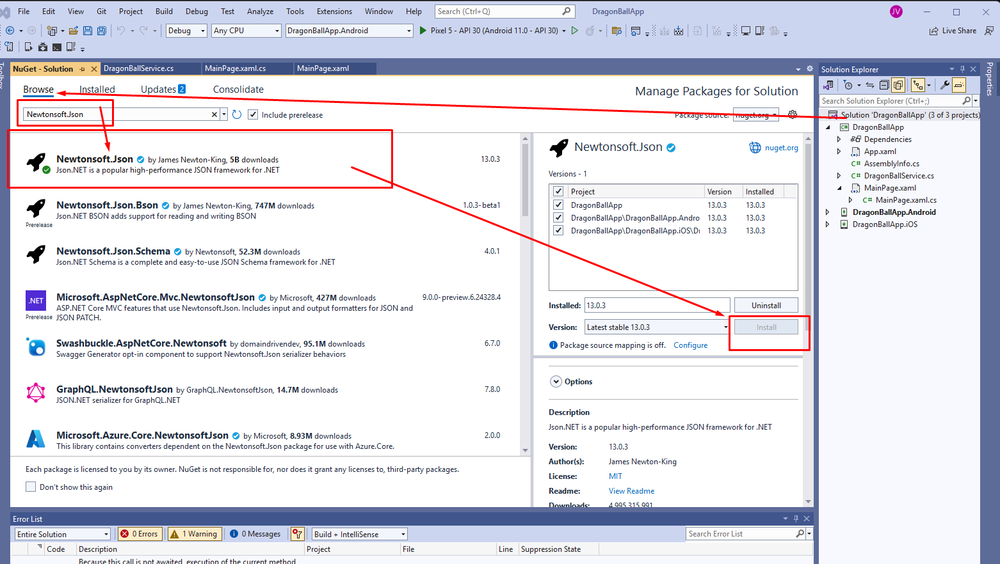

# 🐉 DragonBallApp 🔮 🌟 **Xamarin**, **.NET MAUI**, **C#** y **XAML** 🚀

Bienvenido a DragonBallApp, una aplicación móvil interactiva que te sumerge en el universo de Dragon Ball utilizando Xamarin, .NET MAUI, C# y XAML. Esta app móvil está diseñada para mostrar información detallada sobre los personajes y planetas de Dragon Ball, proporcionando una experiencia enriquecedora y fácil de usar.

La aplicación hace uso de la API pública de Dragon Ball para obtener datos actualizados. Emplea HttpClient para gestionar las peticiones a la API, lo que permite una comunicación eficiente y fluida con el servidor. Para la serialización y deserialización de datos JSON, DragonBallApp utiliza la librería Newtonsoft.Json.

Implementa prácticas de programación asíncrona con async y await para realizar solicitudes HTTP sin bloquear la interfaz de usuario. La arquitectura orientada a objetos facilita la gestión de los datos de personajes y planetas, asegurando una estructura de código clara y mantenible.

Con una interfaz diseñada en XAML y la lógica implementada en C#, DragonBallApp combina la potencia de Xamarin y .NET MAUI para ofrecer una experiencia móvil moderna y responsiva. ¡Explora el universo de Dragon Ball con DragonBallApp y disfruta de la programación móvil en acción!

## Descripción

### DragonBallApp permite a los usuarios:

- 🔍 Buscar personajes y planetas.
- 👀 Ver detalles de cada personaje y planeta.
- 🖼️ Disfrutar de imágenes de alta calidad.
- 📱 Navegar fácilmente con una interfaz responsiva.

| Imagen 1 | Imagen 2 | Imagen 3 | Imagen 4 | Imagen 5 |
|:---------:|:---------:|:---------:|:---------:|:---------:|
|  |  |  |   |   |
| Portada 1 | Portada 2 | Portada 3 | Portada 4 | Portada 4 |


## Tecnologías Utilizadas

- **Xamarin.Forms**: Para crear la interfaz de usuario multiplataforma.
- **.NET Standard**: Para la lógica compartida.
- **HttpClient**: Para realizar solicitudes HTTP a la API de Dragon Ball.
- **Newtonsoft.Json**: Para deserializar las respuestas JSON de la API.

## Librerías y Plugins

- `Xamarin.Forms`
- `Newtonsoft.Json`
- `System.Net.Http`

## API Utilizada

- **Documentation Dragon Ball API**: [https://web.dragonball-api.com/documentation](https://web.dragonball-api.com/documentation)
- **Ejemplo de la API**: [https://web.dragonball-api.com/](https://web.dragonball-api.com/)
- **Dragon Ball API**: [https://dragonball-api.com](https://dragonball-api.com)
  - **Endpoint de personajes**: `https://dragonball-api.com/api/characters?limit=1000`
  - **Endpoint de planetas**: `https://dragonball-api.com/api/planets?limit=1000`

## Métodos y Funcionalidades

- **LoadCharacters**: Carga y muestra una lista de personajes.
- **OnCharactersClicked**: Maneja el evento de clic en el botón de personajes.
- **OnPlanetsClicked**: Maneja el evento de clic en el botón de planetas.
- **OnSearchTextChanged**: Filtra la lista de personajes o planetas según el texto de búsqueda.
- **OnClearClicked**: Limpia el campo de búsqueda y restaura la lista completa.

## Tipo de Programación

- **Programación Orientada a Objetos (OOP)**: Estructura el código en clases y objetos para una mayor modularidad y reutilización del código. Por ejemplo, puedes tener clases como `Character` y `Planet` que representan entidades en la aplicación.
- **Programación Basada en Componentes**: Crea componentes reutilizables (si se aplica en el proyecto web) para manejar partes específicas de la interfaz de usuario.
- **Desarrollo Basado en Eventos**: Maneja interacciones del usuario y eventos como clics en botones.
- **Programación Asíncrona**: Utiliza `async` y `await` para realizar solicitudes HTTP sin bloquear la interfaz de usuario. Esto permite que la aplicación sea más responsiva mientras espera la respuesta del servidor.

## Paso a Paso y Creación de Archivos

### 1. Crear el Proyecto

1. Abre Visual Studio.
2. Selecciona "Crear un nuevo proyecto".
3. Elige "Aplicación Xamarin.Forms" y sigue las instrucciones para crear el proyecto.

### 2. Crear la Página Principal (`MainPage.xaml`)

```xml
<?xml version="1.0" encoding="utf-8" ?>
<ContentPage xmlns="http://xamarin.com/schemas/2014/forms"
             xmlns:x="http://schemas.microsoft.com/winfx/2009/xaml"
             x:Class="DragonBallApp.MainPage">

    <StackLayout Padding="10">
        <Frame Padding="5"
       Margin="5"
       CornerRadius="15"
       HasShadow="True"
       BorderColor="LightGray"
       BackgroundColor="White">
            <Label Text="🐲 Dragon Ball Characters 🌍"
           FontSize="24"
           FontAttributes="Bold"
           HorizontalOptions="Center"
           VerticalOptions="Center"
           TextColor="Black"
           Padding="10"/>
        </Frame>

        <!-- Menu -->
        <StackLayout Orientation="Horizontal"
             HorizontalOptions="CenterAndExpand"
             Spacing="20"
             Padding="5">

            <Button Text="🦸‍♂️ Personajes"
            Clicked="OnCharactersClicked"
            BackgroundColor="#4CAF50"
            TextColor="White"
            FontSize="16"
            CornerRadius="5"
            HeightRequest="70"
            WidthRequest="150"
            BorderColor="#388E3C"
            BorderWidth="2"/>

            <Button Text="🌍 Planetas"
            Clicked="OnPlanetsClicked"
            BackgroundColor="#2196F3"
            TextColor="White"
            FontSize="16"
            CornerRadius="5"
            HeightRequest="60"
            WidthRequest="130"
            BorderColor="#1976D2"
            BorderWidth="2"/>

        </StackLayout>


        <!-- Barra de búsqueda y botón limpiar -->
        <StackLayout Orientation="Horizontal" HorizontalOptions="CenterAndExpand" Padding="1" Margin="20">
            <SearchBar x:Name="searchBar" Placeholder="Buscar..." TextChanged="OnSearchTextChanged" WidthRequest="250" />
            <Button Text="cLEAR" Clicked="OnClearClicked" BackgroundColor="#fbc531" />
        </StackLayout>

        <!-- Lista de tarjetas -->
        <CollectionView x:Name="collectionView">
            <CollectionView.ItemTemplate>
                <DataTemplate>
                    <Frame Padding="10" Margin="5" BorderColor="LightGray" CornerRadius="10">
                        <StackLayout>
                            <Label Text="{Binding Name}" FontSize="35" FontAttributes="Bold" HorizontalOptions="CenterAndExpand"/>
                            <Image Source="{Binding Image}" HeightRequest="500" Aspect="AspectFit" HorizontalOptions="CenterAndExpand"/>
                            <Label Text="{Binding Description}" FontSize="20" HorizontalTextAlignment="Center"/>
                        </StackLayout>
                    </Frame>
                </DataTemplate>
            </CollectionView.ItemTemplate>
        </CollectionView>
    </StackLayout>
</ContentPage>
```
# Proceso de Serialización y Deserialización con Newtonsoft.Json

Este proyecto demuestra cómo usar la biblioteca `Newtonsoft.Json` para la serialización y deserialización de datos JSON en aplicaciones C#.

## Instalación

Para instalar `Newtonsoft.Json` utilizando el Administrador de Paquetes NuGet en Visual Studio, sigue estos pasos:

1. Abre tu solución en Visual Studio.
2. Haz clic derecho en la solución del proyecto en el Explorador de Soluciones.
3. Selecciona "Administrar paquetes NuGet...".

   
   
6. En la pestaña "Examinar", busca `Newtonsoft.Json`.
7. Selecciona `Newtonsoft.Json` en los resultados de búsqueda y haz clic en "Instalar".
8. Asegúrate de que la versión sea la 13.0.1 o superior y sigue las instrucciones para completar la instalación.



### 3. Crear el Código Detrás de la Página (MainPage.xaml.cs):

```cs
using System;
using System.Collections.Generic;
using System.Linq;
using System.Threading.Tasks;
using Xamarin.Forms;

namespace DragonBallApp
{
    public partial class MainPage : ContentPage
    {
        private DragonBallService _dragonBallService;
        private List<Character> _allCharacters;
        private List<Planet> _allPlanets;

        public MainPage()
        {
            InitializeComponent();
            _dragonBallService = new DragonBallService();
            LoadCharacters();
        }

        private async Task LoadCharacters()
        {
            try
            {
                var characters = await _dragonBallService.GetCharactersAsync();
                _allCharacters = characters;
                collectionView.ItemsSource = characters;
            }
            catch (Exception ex)
            {
                await DisplayAlert("Error", $"No se pudo cargar la información: {ex.Message}", "OK");
            }
        }

        private async void OnCharactersClicked(object sender, EventArgs e)
        {
            await LoadCharacters();
        }

        private async void OnPlanetsClicked(object sender, EventArgs e)
        {
            try
            {
                var planets = await _dragonBallService.GetPlanetsAsync();
                _allPlanets = planets;
                collectionView.ItemsSource = planets;
            }
            catch (Exception ex)
            {
                await DisplayAlert("Error", $"No se pudo cargar la información: {ex.Message}", "OK");
            }
        }

        private void OnSearchTextChanged(object sender, TextChangedEventArgs e)
        {
            var searchText = e.NewTextValue.ToLower();

            if (collectionView.ItemsSource is List<Character> characters)
            {
                collectionView.ItemsSource = _allCharacters.Where(c => c.Name.ToLower().Contains(searchText)).ToList();
            }
            else if (collectionView.ItemsSource is List<Planet> planets)
            {
                collectionView.ItemsSource = _allPlanets.Where(p => p.Name.ToLower().Contains(searchText)).ToList();
            }
        }

        private void OnClearClicked(object sender, EventArgs e)
        {
            searchBar.Text = string.Empty;
            if (collectionView.ItemsSource is List<Character>)
            {
                collectionView.ItemsSource = _allCharacters;
            }
            else if (collectionView.ItemsSource is List<Planet>)
            {
                collectionView.ItemsSource = _allPlanets;
            }
        }
    }
}
```
## AGREGAR EN EL App.xaml.cs eta linea  ( MainPage = new MainPage(); =que quede como esta;

```cs
using System;
using Xamarin.Forms;
using Xamarin.Forms.Xaml;

namespace DragonBallApp
{
    public partial class App : Application
    {
        public App()
        {
            InitializeComponent();

            MainPage = new MainPage();
        }

        protected override void OnStart()
        {
        }

        protected override void OnSleep()
        {
        }

        protected override void OnResume()
        {
        }
    }
}

```

## 4. Crear el Servicio de Dragon Ball (DragonBallService.cs)

```cs
using System;
using System.Collections.Generic;
using System.Net.Http;
using System.Threading.Tasks;
using Newtonsoft.Json;

public class DragonBallService
{
    private static readonly HttpClient client = new HttpClient();
    private const string charactersUrl = "https://dragonball-api.com/api/characters?limit=1000";
    private const string planetsUrl = "https://dragonball-api.com/api/planets?limit=1000";

    public async Task<List<Character>> GetCharactersAsync()
    {
        try
        {
            var response = await client.GetStringAsync(charactersUrl);
            var result = JsonConvert.DeserializeObject<ApiResponse<Character>>(response);
            return result.Items;
        }
        catch (HttpRequestException e)
        {
            Console.WriteLine($"Request error: {e.Message}");
            return new List<Character>();
        }
    }

    public async Task<List<Planet>> GetPlanetsAsync()
    {
        try
        {
            var response = await client.GetStringAsync(planetsUrl);
            var result = JsonConvert.DeserializeObject<ApiResponse<Planet>>(response);
            return result.Items;
        }
        catch (HttpRequestException e)
        {
            Console.WriteLine($"Request error: {e.Message}");
            return new List<Planet>();
        }
    }
}

public class ApiResponse<T>
{
    public List<T> Items { get; set; }
    public Meta Meta { get; set; }
}

public class Meta
{
    public int TotalItems { get; set; }
    public int ItemCount { get; set; }
    public int ItemsPerPage { get; set; }
    public int TotalPages { get; set; }
    public int CurrentPage { get; set; }
}

public class Character
{
    public int Id { get; set; }
    public string Name { get; set; }
    public string Description { get; set; }
    public string Image { get; set; }
}

public class Planet
{
    public int Id { get; set; }
    public string Name { get; set; }
    public string Description { get; set; }
    public string Image { get; set; }
}
```


# 🐉 DragonBallApp 🔮 🌟 Para Usarlo con *.NET MAUI**, **C#** y **XAML** -SOLO TIENE UNOS LIGEROS CAMBIOS AQUI LOS CODIGO: 🚀:

### El código de consumo de API y manejo de datos es prácticamente el mismo; la mayor diferencia al cambiar de Xamarin a MAUI radica en cómo organizas el proyecto y manejas las dependencias y la interfaz de usuario, no en el propio código de la lógica de negocio.


### 2. Crear la Página Principal (`MainPage.xaml`)

```cs
<?xml version="1.0" encoding="utf-8" ?>
<ContentPage xmlns="http://schemas.microsoft.com/dotnet/2021/maui"
             xmlns:x="http://schemas.microsoft.com/winfx/2009/xaml"
             x:Class="DragonBallAppMaui.MainPage">

    <VerticalStackLayout Padding="10">
        <Frame Padding="5"
               Margin="5"
               CornerRadius="15"
               HasShadow="True"
               BorderColor="LightGray"
               BackgroundColor="White">
            <Label Text="🐲 Dragon Ball Characters 🌍"
                   FontSize="24"
                   FontAttributes="Bold"
                   HorizontalOptions="Center"
                   VerticalOptions="Center"
                   TextColor="Black"
                   Padding="10"/>
        </Frame>

        <!-- Menú -->
        <HorizontalStackLayout HorizontalOptions="CenterAndExpand" Spacing="20" Padding="5">
            <Button Text="🦸‍♂️ Personajes"
                    Clicked="OnCharactersClicked"
                    BackgroundColor="#4CAF50"
                    TextColor="White"
                    FontSize="16"
                    CornerRadius="5"
                    HeightRequest="70"
                    WidthRequest="150"
                    BorderColor="#388E3C"
                    BorderWidth="2"/>

            <Button Text="🌍 Planetas"
                    Clicked="OnPlanetsClicked"
                    BackgroundColor="#2196F3"
                    TextColor="White"
                    FontSize="16"
                    CornerRadius="5"
                    HeightRequest="60"
                    WidthRequest="130"
                    BorderColor="#1976D2"
                    BorderWidth="2"/>
        </HorizontalStackLayout>

        <!-- Barra de búsqueda y botón limpiar -->
        <HorizontalStackLayout HorizontalOptions="CenterAndExpand" Padding="1" Margin="20">
            <SearchBar x:Name="searchBar"
                       Placeholder="Buscar..."
                       TextChanged="OnSearchTextChanged"
                       WidthRequest="250"/>
            <Button Text="CLEAR"
                    Clicked="OnClearClicked"
                    BackgroundColor="#fbc531"/>
        </HorizontalStackLayout>

        <!-- Lista de tarjetas -->
        <CollectionView x:Name="collectionView">
            <CollectionView.ItemTemplate>
                <DataTemplate>
                    <Frame Padding="10" Margin="5" BorderColor="LightGray" CornerRadius="10">
                        <VerticalStackLayout>
                            <Label Text="{Binding Name}" FontSize="35" FontAttributes="Bold" HorizontalOptions="CenterAndExpand"/>
                            <Image Source="{Binding Image}" HeightRequest="200" Aspect="AspectFit" HorizontalOptions="CenterAndExpand"/>
                            <Label Text="{Binding Description}" FontSize="20" HorizontalTextAlignment="Center"/>
                        </VerticalStackLayout>
                    </Frame>
                </DataTemplate>
            </CollectionView.ItemTemplate>
        </CollectionView>
    </VerticalStackLayout>
</ContentPage>
```

### 3. Crear el Código Detrás de la Página (MainPage.xaml.cs):

```cs

using System;
using System.Collections.Generic;
using System.Linq;
using System.Threading.Tasks;
using Microsoft.Maui.Controls;

namespace DragonBallAppMaui
{
    public partial class MainPage : ContentPage
    {
        private DragonBallService _dragonBallService;
        private List<Character> _allCharacters;
        private List<Planet> _allPlanets;

        public MainPage()
        {
            InitializeComponent();
            _dragonBallService = new DragonBallService();
            LoadCharacters();
        }

        private async Task LoadCharacters()
        {
            try
            {
                var characters = await _dragonBallService.GetCharactersAsync();
                _allCharacters = characters;
                collectionView.ItemsSource = characters;
            }
            catch (Exception ex)
            {
                await DisplayAlert("Error", $"No se pudo cargar la información: {ex.Message}", "OK");
            }
        }

        private async void OnCharactersClicked(object sender, EventArgs e)
        {
            await LoadCharacters();
        }

        private async void OnPlanetsClicked(object sender, EventArgs e)
        {
            try
            {
                var planets = await _dragonBallService.GetPlanetsAsync();
                _allPlanets = planets;
                collectionView.ItemsSource = planets;
            }
            catch (Exception ex)
            {
                await DisplayAlert("Error", $"No se pudo cargar la información: {ex.Message}", "OK");
            }
        }

        private void OnSearchTextChanged(object sender, TextChangedEventArgs e)
        {
            var searchText = e.NewTextValue.ToLower();

            if (collectionView.ItemsSource is List<Character> characters)
            {
                collectionView.ItemsSource = _allCharacters.Where(c => c.Name.ToLower().Contains(searchText)).ToList();
            }
            else if (collectionView.ItemsSource is List<Planet> planets)
            {
                collectionView.ItemsSource = _allPlanets.Where(p => p.Name.ToLower().Contains(searchText)).ToList();
            }
        }

        private void OnClearClicked(object sender, EventArgs e)
        {
            searchBar.Text = string.Empty;
            if (collectionView.ItemsSource is List<Character>)
            {
                collectionView.ItemsSource = _allCharacters;
            }
            else if (collectionView.ItemsSource is List<Planet>)
            {
                collectionView.ItemsSource = _allPlanets;
            }
        }
    }
}

```

## 4. Crear el Servicio de Dragon Ball (DragonBallService.cs)

```cs

using System;
using System.Collections.Generic;
using System.Net.Http;
using System.Threading.Tasks;
using Newtonsoft.Json;

namespace DragonBallAppMaui
{
    public class DragonBallService
    {
        private static readonly HttpClient client = new HttpClient();
        private const string charactersUrl = "https://dragonball-api.com/api/characters?limit=1000";
        private const string planetsUrl = "https://dragonball-api.com/api/planets?limit=1000";

        public async Task<List<Character>> GetCharactersAsync()
        {
            try
            {
                var response = await client.GetStringAsync(charactersUrl);
                var result = JsonConvert.DeserializeObject<ApiResponse<Character>>(response);
                return result.Items;
            }
            catch (HttpRequestException e)
            {
                Console.WriteLine($"Request error: {e.Message}");
                return new List<Character>();
            }
        }

        public async Task<List<Planet>> GetPlanetsAsync()
        {
            try
            {
                var response = await client.GetStringAsync(planetsUrl);
                var result = JsonConvert.DeserializeObject<ApiResponse<Planet>>(response);
                return result.Items;
            }
            catch (HttpRequestException e)
            {
                Console.WriteLine($"Request error: {e.Message}");
                return new List<Planet>();
            }
        }
    }

    public class ApiResponse<T>
    {
        public List<T> Items { get; set; }
        public Meta Meta { get; set; }
    }

    public class Meta
    {
        public int TotalItems { get; set; }
        public int ItemCount { get; set; }
        public int ItemsPerPage { get; set; }
        public int TotalPages { get; set; }
        public int CurrentPage { get; set; }
    }

    public class Character
    {
        public int Id { get; set; }
        public string Name { get; set; }
        public string Description { get; set; }
        public string Image { get; set; }
    }

    public class Planet
    {
        public int Id { get; set; }
        public string Name { get; set; }
        public string Description { get; set; }
        public string Image { get; set; }
    }
}

```


## Explicación de Archivos

### `MainPage.xaml`

Este archivo define la interfaz de usuario de la página principal de la aplicación. En él se diseñan los componentes visuales que los usuarios verán, como los botones para ver personajes y planetas, el campo de búsqueda y el área donde se mostrarán los resultados. La estructura del diseño en `XAML` permite una rápida visualización y ajuste del layout para adaptarse a diferentes tamaños de pantalla, ideal para aplicaciones móviles y de escritorio.

### `MainPage.xaml.cs`

Aquí es donde se encuentra la lógica detrás de la página principal. Este archivo maneja las interacciones del usuario y el flujo de datos. Incluye métodos para cargar personajes y planetas desde la API, manejar los eventos de clic en los botones, y filtrar los resultados según el texto de búsqueda. La separación de la lógica del diseño permite un mantenimiento más sencillo y una mejor organización del código.

### `DragonBallService.cs`

Este archivo contiene el servicio que interactúa con la API de Dragon Ball. Aquí se definen los métodos que realizan solicitudes HTTP para obtener datos de personajes y planetas. Usando este servicio, la aplicación puede acceder a datos actualizados y en tiempo real, lo que enriquece la experiencia del usuario al proporcionar información precisa y relevante sobre el universo de Dragon Ball.

### `Character.cs` y `Planet.cs`:

Estos archivos definen los modelos de datos para personajes y planetas. Cada modelo representa la estructura de los datos que se recibirán de la API, incluyendo propiedades como nombres, imágenes y descripciones. Tener modelos bien definidos facilita el manejo y la visualización de los datos en la aplicación, asegurando que la información se muestre de manera consistente y correcta.

## Conclusión:

DragonBallApp no solo es una aplicación interactiva y educativa que permite a los fanáticos de Dragon Ball explorar información detallada sobre sus personajes y planetas favoritos, sino que también es una excelente oportunidad para aprender y practicar habilidades de programación. Al trabajar en este proyecto, tanto los entusiastas del anime como los programadores pueden:

- **Mejorar su comprensión de la Programación Orientada a Objetos (OOP)**: Al estructurar el código en clases y métodos, aprendemos a organizar y gestionar mejor la lógica y los datos.
- **Practicar la Programación Asíncrona**: Usar `async` y `await` para manejar solicitudes HTTP sin bloquear la interfaz de usuario mejora nuestra habilidad para trabajar con operaciones asíncronas en aplicaciones reales.
- **Diseñar Interfaces de Usuario**: Crear interfaces atractivas y funcionales en `XAML` o HTML/CSS ayuda a desarrollar habilidades en diseño y usabilidad.

Este proyecto es una forma divertida y educativa de aplicar conceptos de programación mientras se explora un universo tan querido como el de Dragon Ball Z. 

Además, te invito a explorar dos proyectos adicionales:

1. **[Proyecto HTML, CSS y JS Puro](#)**: URL: https://github.com/JUANCITOPENA/DRAGON_BALL_Z_V:  Para una experiencia básica y fundamental en desarrollo web.
2. **[Proyecto con React](#)**: URL: https://github.com/JUANCITOPENA/dragon-ball-project_react :  Para una versión más moderna y dinámica usando React.

¡No olvides compartir estos proyectos en tus redes sociales y darle una estrellita en el repositorio para apoyar el desarrollo de más contenido! 🌟

## 📜 Licencia

Este proyecto está bajo la Licencia MIT. Consulta el archivo `LICENSE` para más detalles.

## 🚀 Áreas de Mejora

Aunque este proyecto ya es funcional, hay varias áreas en las que se podría mejorar:

1. 🛠️ **Manejo de Errores**: Implementar un manejo de errores más robusto para las llamadas a la API.
2. ⏳ **Estados de Carga**: Añadir indicadores de carga más detallados mientras se obtienen los datos.
3. 🚪 **Cierre de Modal**: Agregar un botón de cierre explícito a los modales para mejorar la experiencia del usuario.
4. 📱 **Diseño Responsivo**: Asegurar que todos los componentes sean completamente responsivos en diferentes tamaños de pantalla.
5. 🔄 **Duplicación de Código**: Considerar la creación de un servicio de API compartido para reducir la duplicación en `Characters.js` y `Planets.js`.
6. ✅ **Comprobación de Tipos**: Considerar añadir PropTypes o TypeScript para una mejor comprobación de tipos y prevención de errores.
7. 🌐 **Internacionalización**: Implementar soporte para múltiples idiomas para hacer la aplicación accesible a una audiencia más amplia.
8. 🎨 **Temas**: Añadir soporte para temas claro y oscuro para mejorar la experiencia del usuario en diferentes condiciones de iluminación.

## 📚 Recursos Adicionales

- [Documentación de React](https://reactjs.org/docs/getting-started.html)
- [Documentación de React Router](https://reactrouter.com/web/guides/quick-start)
- [Documentación de Bootstrap](https://getbootstrap.com/docs/5.0/getting-started/introduction/)
- [Dragon Ball API Documentation](https://dragonball-api.com/documentation) (ficticia, reemplazar con la documentación real si existe)

## 📞 Contacto

Si tienes alguna pregunta o sugerencia, no dudes en abrir un issue o contactar al mantenedor del proyecto:

👤 [JUANCITO PEÑA](https://github.com/JUANCITOPENA)

No olvides suscribirte, darle like, y compartir este video para ayudarnos a seguir creando contenido como este. ¡Vamos a comenzar! 😊📡

DragonBallApp 🚀📱🌟, Xamarin #DesarrolloMóvil, #XamarinForms, .NET MAUI #DesarrolloCrossPlatform, #AplicacionesMóviles, C# #ProgramaciónOrientadaAObjetos, #LenguajeDeProgramación, XAML #DiseñoDeInterfaz ,#DesarrolloDeUI, API pública de Dragon Ball, #IntegraciónDeAPI #DatosActualizados, HttpClient #ComunicaciónHTTP #SolicitudesAsíncronas, Newtonsoft.Json #SerializaciónJSON, #Deserialización, Programación Asíncrona #AsyncAwait, #ExperienciaDeUsuario, ArquitecturaOrientadaAObjetos, #EstructuraDeCódigo #Mantenibilidad.

1. 🎬 **YouTube**: [@JuancitoPenaV](https://www.youtube.com/@JuancitoPenaV)
2. 👨‍💼 **LinkedIn**: [Juancito Peña](https://www.linkedin.com/in/juancitope%C3%B1a/)
3. 📷 **Instagram**: [@juancito.pena.v](https://www.instagram.com/juancito.pena.v/)
4. 📑 **Facebook**: [Juancito Peña V](https://www.facebook.com/juancito.p.v)
5. 🐦 **Twitter**: [@JuancitoPenaV](https://twitter.com/JuancitoPenaV)
6. 📰 **Blog**: [Adviser Tecnology](https://advisertecnology.com/)

---

🐉 ¡Disfruta explorando el universo de Dragon Ball con nuestra aplicación! 🌟

