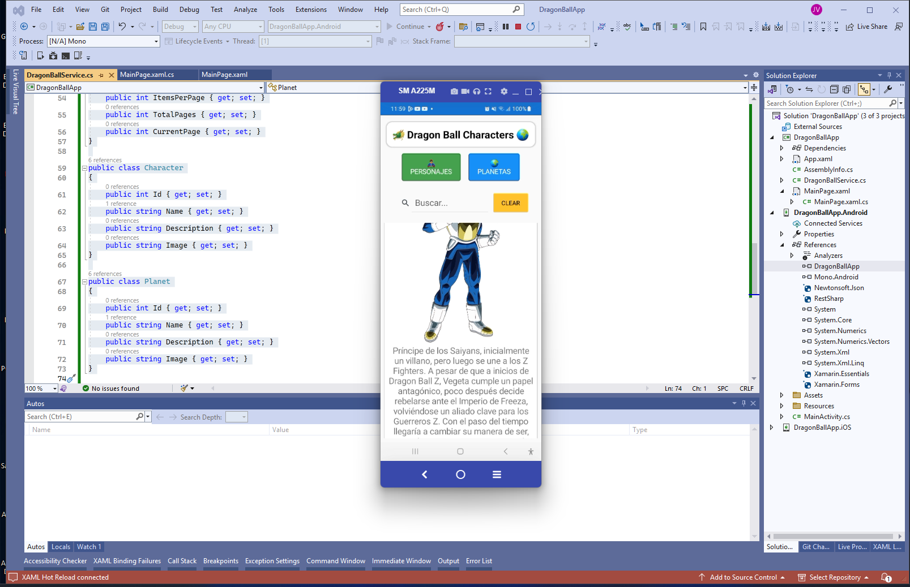
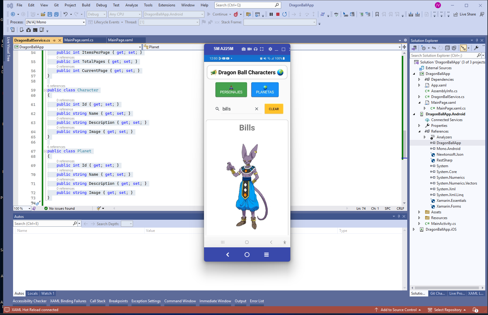
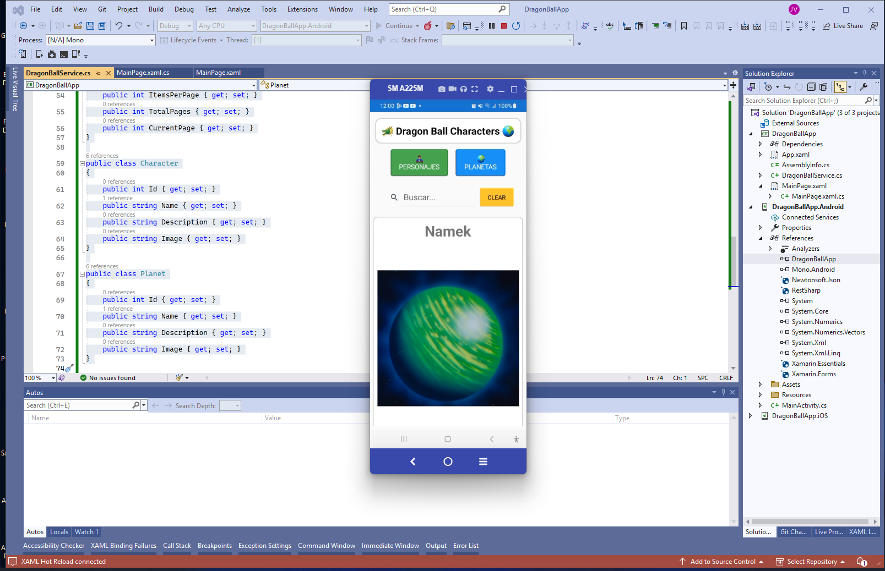
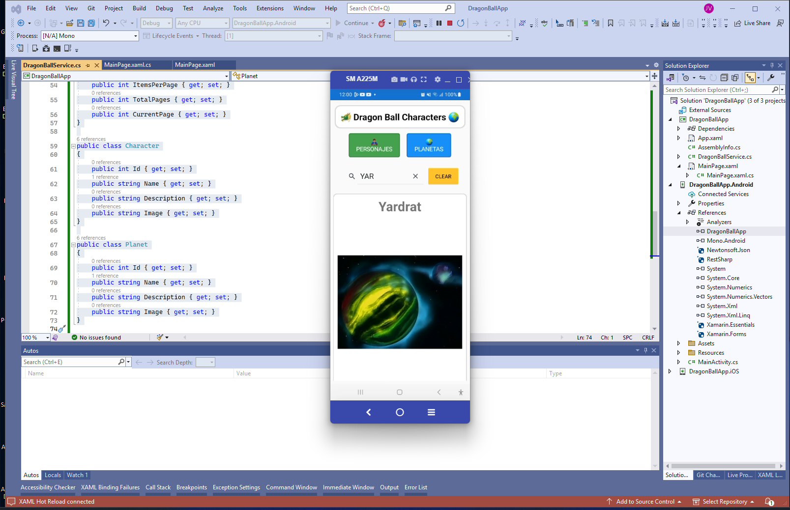

# DragonBallApp

Bienvenido a DragonBallApp, una aplicación web interactiva que muestra información sobre los personajes y planetas del universo Dragon Ball. Utilizando la API pública de Dragon Ball, esta aplicación ofrece una interfaz amigable para explorar y conocer más sobre este fascinante mundo.

## Descripción

DragonBallApp permite a los usuarios:
- 🔍 Buscar personajes y planetas.
- 👀 Ver detalles de cada personaje y planeta.
- 🖼️ Disfrutar de imágenes de alta calidad.
- 📱 Navegar fácilmente con una interfaz responsiva.

| Imagen 1 | Imagen 2 | Imagen 3 | Imagen 4 | Imagen 5 |
|:---------:|:---------:|:---------:|:---------:|:---------:|
|  |  |  |   |   |
| Portada 1 | Portada 2 | Portada 3 | Portada 4 | Portada 4 |


## Tecnologías Utilizadas

- **Xamarin.Forms**: Para crear la interfaz de usuario multiplataforma.
- **.NET Standard**: Para la lógica compartida.
- **HttpClient**: Para realizar solicitudes HTTP a la API de Dragon Ball.
- **Newtonsoft.Json**: Para deserializar las respuestas JSON de la API.

## Librerías y Plugins

- `Xamarin.Forms`
- `Newtonsoft.Json`
- `System.Net.Http`

## API Utilizada

- **Dragon Ball API**: [https://dragonball-api.com](https://dragonball-api.com)
  - **Endpoint de personajes**: `https://dragonball-api.com/api/characters?limit=1000`
  - **Endpoint de planetas**: `https://dragonball-api.com/api/planets?limit=1000`

## Métodos y Funcionalidades

- **LoadCharacters**: Carga y muestra una lista de personajes.
- **OnCharactersClicked**: Maneja el evento de clic en el botón de personajes.
- **OnPlanetsClicked**: Maneja el evento de clic en el botón de planetas.
- **OnSearchTextChanged**: Filtra la lista de personajes o planetas según el texto de búsqueda.
- **OnClearClicked**: Limpia el campo de búsqueda y restaura la lista completa.

## Tipo de Programación

- **Programación Orientada a Objetos (OOP)**: Estructura el código en clases y objetos para una mayor modularidad y reutilización del código. Por ejemplo, puedes tener clases como `Character` y `Planet` que representan entidades en la aplicación.
- **Programación Basada en Componentes**: Crea componentes reutilizables (si se aplica en el proyecto web) para manejar partes específicas de la interfaz de usuario.
- **Desarrollo Basado en Eventos**: Maneja interacciones del usuario y eventos como clics en botones.
- **Programación Asíncrona**: Utiliza `async` y `await` para realizar solicitudes HTTP sin bloquear la interfaz de usuario. Esto permite que la aplicación sea más responsiva mientras espera la respuesta del servidor.

## Paso a Paso y Creación de Archivos

### 1. Crear el Proyecto

1. Abre Visual Studio.
2. Selecciona "Crear un nuevo proyecto".
3. Elige "Aplicación Xamarin.Forms" y sigue las instrucciones para crear el proyecto.

### 2. Crear la Página Principal (`MainPage.xaml`)

```xml
<?xml version="1.0" encoding="utf-8" ?>
<ContentPage xmlns="http://xamarin.com/schemas/2014/forms"
             xmlns:x="http://schemas.microsoft.com/winfx/2009/xaml"
             x:Class="DragonBallApp.MainPage">

    <StackLayout Padding="10">
        <Frame Padding="5" Margin="5" CornerRadius="15" HasShadow="True" BorderColor="LightGray" BackgroundColor="White">
            <Label Text="🐲 Dragon Ball Characters 🌍" FontSize="24" FontAttributes="Bold" HorizontalOptions="Center" VerticalOptions="Center" TextColor="Black" Padding="10"/>
        </Frame>

        <!-- Menu -->
        <StackLayout Orientation="Horizontal" HorizontalOptions="CenterAndExpand" Spacing="20" Padding="5">
            <Button Text="🦸‍♂️ Personajes" Clicked="OnCharactersClicked" BackgroundColor="#4CAF50" TextColor="White" FontSize="16" CornerRadius="5" HeightRequest="70" WidthRequest="150" BorderColor="#388E3C" BorderWidth="2"/>
            <Button Text="🌍 Planetas" Clicked="OnPlanetsClicked" BackgroundColor="#2196F3" TextColor="White" FontSize="16" CornerRadius="5" HeightRequest="60" WidthRequest="130" BorderColor="#1976D2" BorderWidth="2"/>
        </StackLayout>

        <!-- Barra de búsqueda y botón limpiar -->
        <StackLayout Orientation="Horizontal" HorizontalOptions="CenterAndExpand" Padding="1" Margin="20">
            <SearchBar x:Name="searchBar" Placeholder="Buscar..." TextChanged="OnSearchTextChanged" WidthRequest="250" />
            <Button Text="Limpiar" Clicked="OnClearClicked" BackgroundColor="#fbc531" />
        </StackLayout>

        <!-- Lista de tarjetas -->
        <CollectionView x:Name="collectionView">
            <CollectionView.ItemTemplate>
                <DataTemplate>
                    <Frame Padding="10" Margin="5" BorderColor="LightGray" CornerRadius="10">
                        <StackLayout>
                            <Label Text="{Binding Name}" FontSize="35" FontAttributes="Bold" HorizontalOptions="CenterAndExpand"/>
                            <Image Source="{Binding Image}" HeightRequest="500" Aspect="AspectFit" HorizontalOptions="CenterAndExpand"/>
                            <Label Text="{Binding Description}" FontSize="20" HorizontalTextAlignment="Center"/>
                        </StackLayout>
                    </Frame>
                </DataTemplate>
            </CollectionView.ItemTemplate>
        </CollectionView>
    </StackLayout>
</ContentPage>
```

### 3. Crear el Código Detrás de la Página (MainPage.xaml.cs):

```xml

using System;
using System.Collections.Generic;
using System.Linq;
using System.Threading.Tasks;
using Xamarin.Forms;

namespace DragonBallApp
{
    public partial class MainPage : ContentPage
    {
        private DragonBallService _dragonBallService;
        private List<Character> _allCharacters;
        private List<Planet> _allPlanets;

        public MainPage()
        {
            InitializeComponent();
            _dragonBallService = new DragonBallService();
            LoadCharacters();
        }

        private async Task LoadCharacters()
        {
            try
            {
                var characters = await _dragonBallService.GetCharactersAsync();
                _allCharacters = characters;
                collectionView.ItemsSource = characters;
            }
            catch (Exception ex)
            {
                await DisplayAlert("Error", $"No se pudo cargar la información: {ex.Message}", "OK");
            }
        }

        private async void OnCharactersClicked(object sender, EventArgs e)
        {
            await LoadCharacters();
        }

        private async void OnPlanetsClicked(object sender, EventArgs e)
        {
            try
            {
                var planets = await _dragonBallService.GetPlanetsAsync();
                _allPlanets = planets;
                collectionView.ItemsSource = planets;
            }
            catch (Exception ex)
            {
                await DisplayAlert("Error", $"No se pudo cargar la información: {ex.Message}", "OK");
            }
        }

        private void OnSearchTextChanged(object sender, TextChangedEventArgs e)
        {
            var searchText = e.NewTextValue.ToLower();

            if (collectionView.ItemsSource is List<Character> characters)
            {
                collectionView.ItemsSource = _allCharacters.Where(c => c.Name.ToLower().Contains(searchText)).ToList();
            }
            else if (collectionView.ItemsSource is List<Planet> planets)
            {
                collectionView.ItemsSource = _allPlanets.Where(p => p.Name.ToLower().Contains(searchText)).ToList();
            }
        }

        private void OnClearClicked(object sender, EventArgs e)
        {
            searchBar.Text = string.Empty;
            if (collectionView.ItemsSource is List<Character>)
            {
                collectionView.ItemsSource = _allCharacters;
            }
            else if (collectionView.ItemsSource is List<Planet>)
            {
                collectionView.ItemsSource = _allPlanets;
            }
        }
    }
}

```

## 4. Crear el Servicio de Dragon Ball (DragonBallService.cs)

```xml

using System;
using System.Collections.Generic;
using System.Net.Http;
using System.Threading.Tasks;
using Newtonsoft.Json;

public class DragonBallService
{
    private static readonly HttpClient client = new HttpClient();
    private const string charactersUrl = "https://dragonball-api.com/api/characters?limit=1000";
    private const string planetsUrl = "https://dragonball-api.com/api/planets?limit=1000";

    public async Task<List<Character>> GetCharactersAsync()
    {
        try
        {
            var response = await client.GetStringAsync(charactersUrl);
            var result = JsonConvert.DeserializeObject<ApiResponse<Character>>(response);
            return result.Items;
        }
        catch (HttpRequestException e)
        {
            Console.WriteLine($"Request error: {e.Message}");
            return new List<Character>();
        }
    }

    public async Task<List<Planet>> GetPlanetsAsync()
    {
        try
        {
            var response = await client.GetStringAsync(planetsUrl);
            var result = JsonConvert.DeserializeObject<ApiResponse<Planet>>(response);
            return result.Items;
        }
        catch (HttpRequestException e)
        {
            Console.WriteLine($"Request error: {e.Message}");
            return new List<Planet>();
        }
    }
}

public class ApiResponse<T>
{
    public List<T> Items { get; set; }
    public Meta Meta { get; set; }
}

public class Meta
{
    public int TotalItems { get; set; }
    public int ItemCount { get; set; }
    public int ItemsPerPage { get; set; }
    public int TotalPages { get; set; }
    public int CurrentPage { get; set; }
}

public class Character
{
    public int Id { get; set; }
    public string Name { get; set; }
    public string Description { get; set; }
    public string Image { get; set; }
}

public class Planet
{
    public int Id { get; set; }
    public string Name { get; set; }
    public string Description { get; set; }
    public string Image { get; set; }
}

```

### Explicación de Archivos:

MainPage.xaml: Define la interfaz de usuario de la página principal.
MainPage.xaml.cs: Contiene la lógica de la página principal, incluyendo la carga de personajes y planetas, y el manejo de eventos.
DragonBallService.cs: Servicio para interactuar con la API de Dragon Ball y obtener datos de personajes y planetas.
Character.cs y Planet.cs: Modelos que representan la estructura de los datos de personajes y planetas.


### Conclusión:

DragonBallApp es una aplicación interactiva y educativa que permite a los fanáticos de Dragon Ball explorar información detallada sobre sus personajes y planetas favoritos. Con una interfaz fácil de usar y datos actualizados desde una API pública, esta aplicación ofrece una experiencia enriquecedora y divertida para todos los usuarios.
